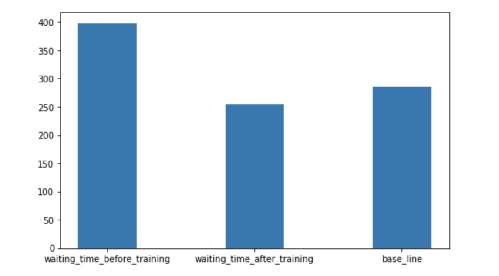

## Project Summary

Our project will simulate a city where many customers continuously order food delivery from a restaurant. Customers will make their orders with certain probability during one day. Our agent will need to deliver the food to the locations where the customers are. Input is the number of delivery men and locations of all customers. Our goal is to deliver foods to all customers within shortest cumulative waiting time in one day.

We are using single agent and multi agents to simulate the world, and tabular q_table as an approach to learn the simulation. The reason why we think AI will have helped a lot is because during a big step of training, the ai will make a smart and forecast move.

For single agent, we use one tabular q_table with one-step Look-ahead approach. There are two models that we compared with our AI: an agent with random move and an agent will go to the nearest house that has orders. We consider the single agent that has a learning rate and has smaller overall waiting time than those two model as a successful training.

For the multi agent, it is much harder for us to just use one cumulative tabular q_table (more details on the Approach). In this way, we are using multiple q_table that each q_table is corresponding to one agent. There are also two models that we compared with our AI: 1. One agent that will go to the nearest point and the other one will go to the latest order. 2. One agent that will go to the nearest point and the other is our single agent. We consider the multi agent  that has a learning rate and has smaller overall waiting time than those two model as a successful training. Also for the most optimized solution, if the house order will separate as two different clusters, we consider if our multi agent will learn to assign each agent to one cluster, we consider as a well successful design.

## Approaches

1. Single Agent:

We are using tabular q_learning with Bellman optimality equation to train our model. By using the Q-Table learning, we store the states, actions and rewards to maintain our Q-Table. 

So during each episode, we will give our q_table a state which is (location of the agent, locations of current order buildings), and each episode is considered as the agent finishes current action. In the previous version of single agent, the action for each state are "left, right, down, up".  But we change the actions for each state as the locations of the house. In this way, we will reduce the size of our q_table a lot. For example, consider the case when we have a grid as 4 * 4 and there is 2 house locations and each house only need to deliver 1 times. So for the previous version if we use four directions as action, the size of our q_table will be (state = 4 * 4 * 2)*(action =  4). But for the latest version which uses location of the house instead, the size of our q_table will reduces to (state = 2 * 2) * (action = 2). 

The current reward for each action during the state is 1000 -(waiting time). What's more, the formula of reward we will give to each Q-Table entrance is  

    

By compute the q value of each entry in q_table with Bellman optimality equation, we promise that we not only care about the current reward, but also care about the future rewards or impacts if we make the action.

2. Multi Agent:

We also using tabular q_learning with Bellman optimality equation approach to train our model. 

But multi-agent implementation is much harder than implementation of single agent. One reason is because each agent will finish the action in different times, in this way, the next state that we wish to have will have a big chance won’t show. Consider the case under,  

    

We have two agents here: a1, a2 and we have three houses that allow these two agents to go to (h1, h2 and h3).   

State 1 is the current state our multi-agent is facing. A1 and a2 are both at house h2 and after we using q_table to get the best policy (the small right graph under the state 1 is considered as getting the best policy), we want A1 to go to h1 and a2 to go to h3. The next state should be (a1 -> h1, h2, a2->a3). However,since the distance between h1->h2 and h3->h1, it will take different time to require those two agents to arrive.   

Suppose a1 arrives h1 earlier than a2 arrives h3. Because we shouldn't let one agent to wait until another one is finished, we should give a1 a new action to do. In this way, state 2 is considered as a new state that requires our q table to give a new value.

Suppose a2 arrives to h3 now and state 3 is our new state. According to state 1, (a1 arrives to h1 and a2 arrives to h3) is our next state and it is the next targeting state. However, since the a1 arrives h1 earlier than a2 arrives h3, there won't be next targeting state and our reward is seperated in the reward of state 2 + reward of state 3. It is pretty hard to just use one cumulative q_table to do cumulative rewards. What's more, if we are using one cumulative q_table, the action space is also hard to define. For example, when we are at a state and we require our q_table to give us a best policy, they will be possible that only a1 requires an action or both of them requires to give actions. It is also easy to make a mistake to get an action for our one cumulative q_table.  

In this way, instead just implementation with one cumulative q_table, we then change to uses multiple q_tables which each of them is corresponding to one agent and it should also work very prefect. Because considers when we choosing the best policy for the agent 1
When each time one agent finishes its current state, we will give its new action based on its corresponding q_table. The pseudo code is under here  

    

Our reward for each q_table is similar as the single-agent one's which is the 1000 -(waiting time) with Bellman optimality equation. When the agent goes to a house that is doesn't have any order (possible that another agent already delivered food to the house), we have give its a negative reward which prevents it choose the same policy in the future.

## Evaluations
### Single-Agent:
Because it is pretty hard to know whether our single agent finds out the best solution. So as stated in summary, we will use two plot graphs: learning rate and performance comparison as an important factor to evaluate our model.
This is the learning rate of our single agent:

    

This learning rate graph actually is the single agent who runs in the video. By looking through the graph, we know that there is a strong vibration because of insufficient q_table. But after a period of time, the loss rate which is the waiting time seems to converge to a value. In this way, we believe the single agent is learning and tries to find the local minimum.  
This is the comparison of our single agent with the baseline agent:

    

We are choosing an agent who will go to the nearest order place as our baseline agent. As we show in the video, there is a house that is far from other houses. So for the baseline agent, because it will only go to the nearest house, it won’t choose to go the furthest house even though it already has waited a long time which will give him a huge penalty. But for our single agent, as shown in the video, our agent will go to the furthest house at some cases even though there are orders in other nearest houses. In this way, I will consider our agent is smart enough to go to some houses to prevent some hug penalty.

### Multi-Agent:  
s stated in summary, we will use two plot graphs: learning rate and performance comparison as an important factor to evaluate our model.  

     

This is one of the learning rate of our multi-agent. In this sample, we also see that there is a strong vibration at the beginning because of insufficient q_table. But after a period of time, the loss rate which is the waiting time seems to converge to a value.  

This is the comparison of our multi agent with the baseline agent:

    

The baseline agent of our multi-agent is there will be two agents: 1. Go to the nearest locations and 2. Go to the latest order. Also, we don’t allow them to go to the same location which will also increase our difficult. Because in the ideal multi agents solutions, both of our multi agents should reduce the chance to go to the same locations. But by looking through the comparison graph, we also find out after a long period of training, the waiting time of the multi-agent also beats the baseline agent.
 
## Resources Used
- [Q_Table](https://www.youtube.com/watch?v=Cgx6l19y7q0&t=198s)
- [Bellman Equation](https://joshgreaves.com/reinforcement-learning/understanding-rl-the-bellman-equations/)