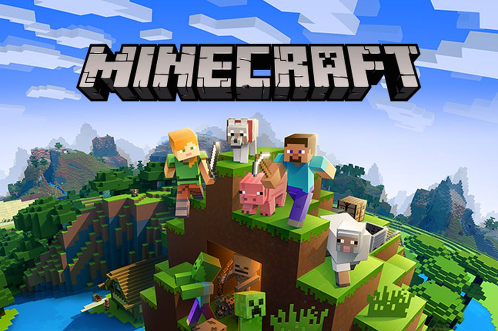

## Welcome to MineDelivery!
Our project will simulate a city where many customers continuously order food delivery from a restaurant. Customers will make their orders with certain probability distribution during one day. Input is the number of delivery men, locations of all customers, and time-based distributions of their orders during one day. Our goal is to deliver foods to all customers within shortest cumulative waiting time in one day.

- Source code: [https://github.com/christineh777/MineDelivery](https://github.com/christineh777/MineDelivery)

Reports:

- [Proposal](proposal.html)
- [Status](status.html)
- [Final](final.html)

Outside Resources:
- [Q_Table](https://www.youtube.com/watch?v=Cgx6l19y7q0&t=198s)