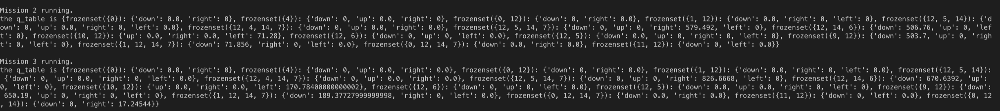

## Video Report
<iframe width="790" height="444" src="https://www.youtube.com/embed/yEyxJONfI3Q" frameborder="0" allow="accelerometer; autoplay; encrypted-media; gyroscope; picture-in-picture" allowfullscreen></iframe>

## Project Summary
Our project will simulate a city where many customers continuously order food delivery from a restaurant. Customers will make their orders with certain probability during one day. Input is the number of delivery men and locations of all customers. Our goal is to deliver foods to all customers within shortest cumulative waiting time in one day.

## Approach:
We are using reinforcement learning to train our model. By using the Q-Table learning, we store the state, action and rewards to maintain our Q-Table. 

During the runtime, we will give our learning model a state which is (location of current order buildings, location of the agent). The actions we allow for each state are "left, right , down, up". The current reward for each action during the state is only -(arrival_time - order_time). What's more, the formula of reward we will give to each Q-Table entrance is 
By using this way, we promise that we not only care about the current reward, but also care about the future rewards or impacts if we make the action. 

In this way, because our order is showing dynamically, after a long time learning, our agent will have some "foresee“ moves to some points which in the future will appear some orders

## Evaluation:
Quantitative:  
The baseline of our project is to assign each food order to the nearest delivery man and complete all the food delivery orders. The way we are using to improve the metrics is by using reinforance learning and Q_Table. 

When actually we start each simulation, our q_table will also be updated and presented in the following:

The key is actually a frozenset of state which is consistent of the location of current ordered buildings and agent location. According to the Approach described upbove, the point in the Q_Table will gives us the best Q_Value that will get.

The value that we will evaluate our performance is:
The cumulative waiting time of all the customers. We will try to minimize the total waiting time of all the customers because if a customer has to wait for a long time for his or her order to come, the satisfaction rate of the customers will be very low.

Qualitative:  
It is hard to manually find out what is the optimize solution for our model. However, if our best_policy() will merge to a value that is the smallest value we have ever seen eventually, we consider we solve the question.

## Remaining Goals and Challenges:
We are thinking to make our model more generally:
1. Generalize our order time more randomly. Currently our order time will still hardcord even thought it will generlize our environment dynamically. But usng random time in the future, we will evaluate our project more easily and generally
2. In the future, we are also considering using multiple agents. Because in the real lives, there are also multiple agents to deliver the food.

## Resources Used
- [Q_Table](https://www.youtube.com/watch?v=Cgx6l19y7q0&t=198s)