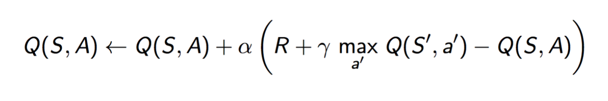

## Project Summary
Our project will simulate a city where many customers continuously order food delivery from a restaurant. Customers will make their orders with certain probability distribution during one day. Input is the number of delivery men, locations of all customers, and time-based distributions of their orders during one day. Our goal is to deliver foods to all customers within shortest cumulative waiting time in one day.

## Approach:
We are using reinforcement learning to train our model. By using the Q-Table learning, we store the state, action and rewards to maintain our Q-Table. 

During the runtime, we will give our learning model a state which is (location of current order buildings, location of the agent). The actions we allow for each state are "left, right , down, up". The current reward for each actions during the state is only -(arrival_time - order_time). What's more, the formula of reward we will give to each Q-Table entrance is 
By using this way, we promise that we not only care about the current reward, but also care about the future rewards or impacts if we make the action. 

In this way, because our order is showing dynamically, after a long time learning, our agent will have some "foresee“ moves to some points which in the future will appear some orders

## Evaluation: